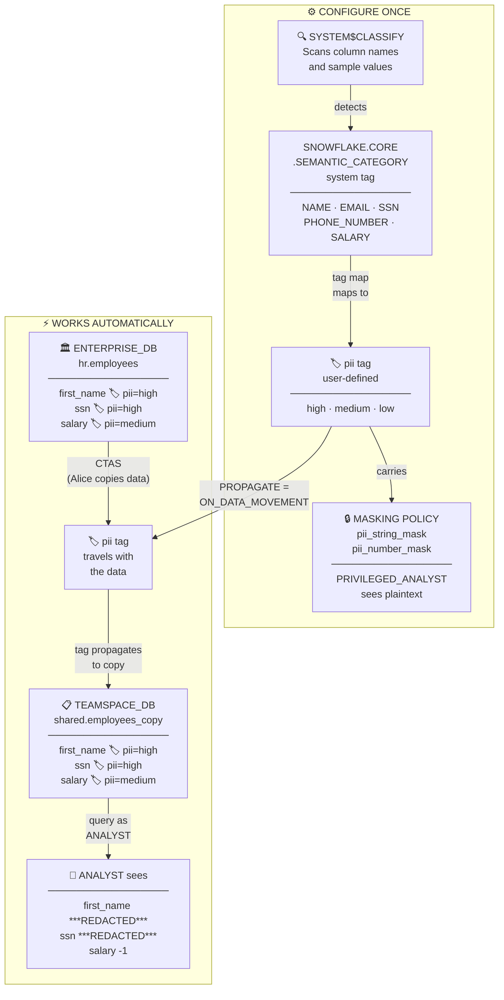

```mermaid
flowchart TB
    subgraph CONFIGURE ["⚙️  CONFIGURE ONCE"]
        direction LR
        A["🔍 SYSTEM$CLASSIFY
Scans column names
and sample values"]
        B["SNOWFLAKE.CORE
.SEMANTIC_CATEGORY
system tag
─────────────────
NAME · EMAIL · SSN
PHONE_NUMBER · SALARY"]
        C["🏷️ pii tag
user-defined
─────────────────
high · medium · low"]
        D["🔒 MASKING POLICY
pii_string_mask
pii_number_mask
─────────────────
PRIVILEGED_ANALYST
sees plaintext"]

        A -->|detects| B
        B -->|"tag map
maps to"| C
        C -->|carries| D
    end

    subgraph RUNTIME ["⚡  WORKS AUTOMATICALLY"]
        direction LR
        E["🏛️ ENTERPRISE_DB
hr.employees
─────────────────
first_name 🏷️ pii=high
ssn 🏷️ pii=high
salary 🏷️ pii=medium"]
        F["🏷️ pii tag
travels with
the data"]
        G["📋 TEAMSPACE_DB
shared.employees_copy
─────────────────
first_name 🏷️ pii=high
ssn 🏷️ pii=high
salary 🏷️ pii=medium"]
        H["🚫 ANALYST sees
─────────────────
first_name ***REDACTED***
ssn ***REDACTED***
salary -1"]

        E -->|"CTAS
(Alice copies data)"| F
        F -->|"tag propagates
to copy"| G
        G -->|"query as
ANALYST"| H
    end

    C -->|"PROPAGATE =
ON_DATA_MOVEMENT"| F
```